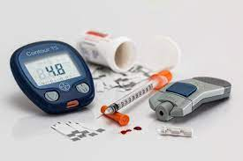

# diabetes-classification

  

  

Esse projeto de **classificação** tem como objetivo prever o diagnóstico de diabetes a partir um conjunto de informações de saúde de um paciente. Utilizei o **CRISP-DM** como metodologia de trabalho durante a execução do projeto. Ao final, coloquei o modelo em produção.

## Entendimento do problema e questão de negócio

* Após uma exploração do contexto do projeto, criei uma **questão de negócio** a ser resolvida: melhorar as métricas de classificação a fim de reduzir os custos por pacientes, com relação a um modelo de previsão simples.

* Em especial, a principal métrica a ser otimizada nesse contexto de negócio é o **recall**.

* O modelo heurístico que criei para *baseline* se baseia em achar o melhor valor de corte de glicose para classificar pacientes diabéticas.

### Métricas do modelo heurístico

Acurácia   | Precisão | **Recall** | F1
---------  | -------- | ------ | -----
70.6%      | 62.2%    | **42.6%**  | 50.5%

----------------------------

## Exploração dos dados e tratamento

* Na **análise exploratória** além das ferramentas do `Pandas` para determinar por exemplo, correlações entre as variáveis. Construi gráficos usando `Matplotlib` e `Seaborn`.

* O principal problema a ser resolvido nos tratamentos dos dados foram os dados faltantes. Utilizei como ferramentas o `KNNImputer`, `KBinsDiscretizer`, `QuantileTransformer` nessa fase de tratamento.

* Dei bastante atenção para evitar alguns erros comums que percebi em outros projetos, como o **data leakage** causado por fazer alterações nos dados antes da separação de treino e teste.

----------------------------

## Modelos de Machine Learning

* Alguns dos modelos de ML utilizados foram `LogisticRegression`, `SVM`, `RandomForestClassifier` e ainda modelos de votação como o `VotingClassifier`. Além da separação **treino-teste**, usei **validação cruzada** para avaliar os modelos visto que nosso dataset é pequeno. Os modelos tiveram um ajuste fino com `GridSearchCV` e `RandomizedSearchCV`.

* Construi **pipelines** para automatizar e organizar o fluxo dos dados utilizando `Pipeline`, `FunctionTransfomer` e `ColumnTransfomer`.

* Ao final do projeto conseguimos uma melhora significativa das métricas, principalmente o **recall**. Em particular, reduzimos bastante o número de **falsos negativos**, o que é importante dentro do contexto do problema. Além disso, obtivemos uma redução de custo por paciente com o nosso modelo.

### Métricas do modelo de Machine Learning (SVM)

Acurácia   | Precisão | **Recall** | F1
---------  | -------- | ------ | -----
74.0%      | 60.0%    | **77.8%**  | 67.7%

## Deploy

* O modelo (pipeline de tratamento + SVM) foi colocado em produção utilizando o **HugginFace** e **Gradio** e pode ser acessado nesse [link](https://huggingface.co/spaces/frank-ferreira/diabetes-clf-deploy).
